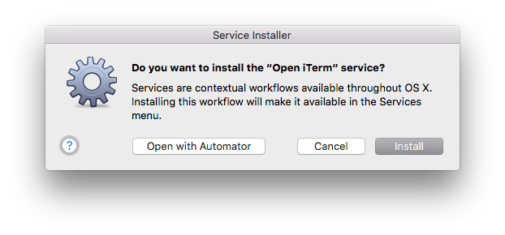
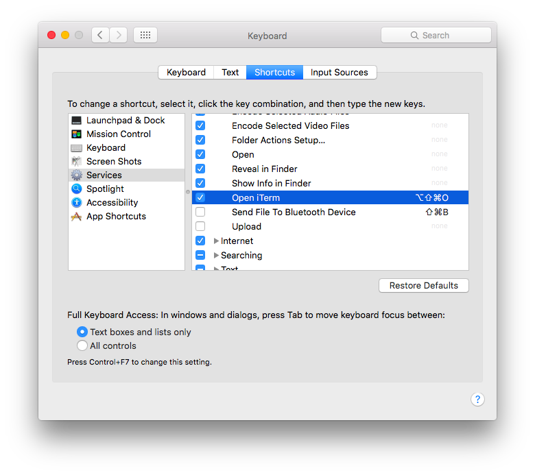
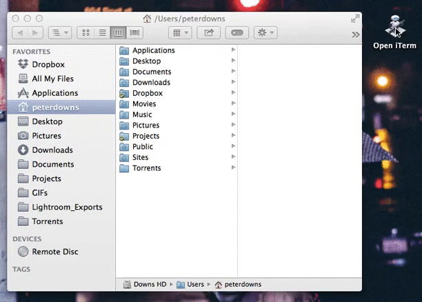

# iTerm2 Finder Tools
New home for the code from [my blogpost about opening iTerm2 directly from the Finder](http://peterdowns.com/posts/open-iterm-finder-service.html). Read [the release post here](http://peterdowns.com/posts/iterm2-finder-tools.html).

### What is it?
A Finder service and toolbar application that will open iTerm2 and `cd` to the
current directory visible in the Finder.

### Features
* Works regardless if iTerm2 is running or not – will start it if necessary.
* Creates a new tab in the current open window for this directory.
* Creates a new window if none are already open.
* Yeah, this is pretty simple, isn't it?

### Version support
This repository includes a pre-built Finder service and a pre-built
application; these work with "modern" iTerm2 (version 2.9+). If you're using an
older version of iTerm2, you'll have to run the build scripts to get a version
that works for you. See the instructions below.

### Installation
First, either download the repository with the big green button in the upper right or clone the repository like this:

```bash
$ git clone https://github.com/peterldowns/iterm2-finder-tools.git
```

##### Finder Service
Double click `Open iTerm.workflow` and click "Install"



You can add a keyboard shortcut for this service by going to `System
Preferences > Keyboard > Shortcuts > Services > Files and Folders`.



Unfortunately, it seems that this keyboard shortcut will only work if iTerm2 is
already running.

##### Finder Menu Tool
You can move the built `Open iTerm.app` anywhere you'd like (such as `/Applications`), or leave it here.

After attempting to run the pre-built application for the first time, you may need to go into your System Preferences > Security & Privacy
and enable running the app since it was built by an "unidentified developer".

You can then add it to your Finder toolbar by dragging it in while holding the command and
option keys (pre-Sierra) or while holding the command key (Sierra or later).



### Build
Build the application and Finder service like this:

```bash
$ python build.py
```

The build script will detect which version of iTerm2 you have installed and
automatically use the right applescript -- `*.modern.applescript` for version
2.9+, and `*.applescript` for older versions.

The build script should work with both Python 2 and Python 3.

### Hacking / Contributing
Edit the `.applescript` files in the `service` and `workflow` directories, then build as described above. You can read the build script for the exact details, but essentially these files are being substituted in to some Automator-based scaffolding to get out the application and service. The `.modern.applescript` files should work with iTerm2 2.9+'s API, and the `.applescript` files should work with their older API.
